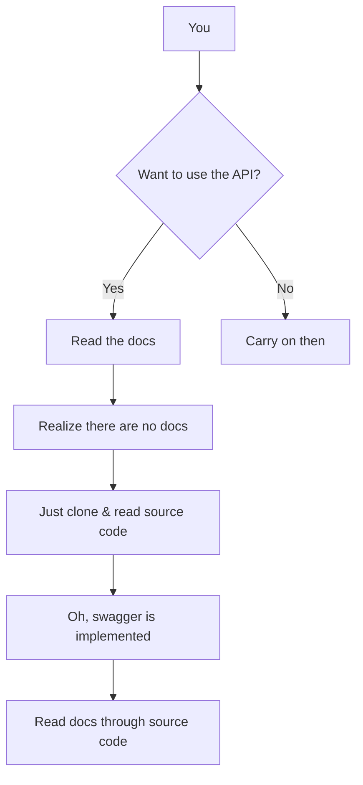

# dota-prefs

```mermaid
flowchart TD
    A["You"] --> B{Want to use the API?};
    B -- Yes --> C[Read the docs];
    B -- No --> D[Carry on then]
    C --> E[Realize there are no docs]
    E --> F[Just clone & read source code]
    F --> G[Oh, swagger is implemented]
    G --> H[Read docs through source code]
```
